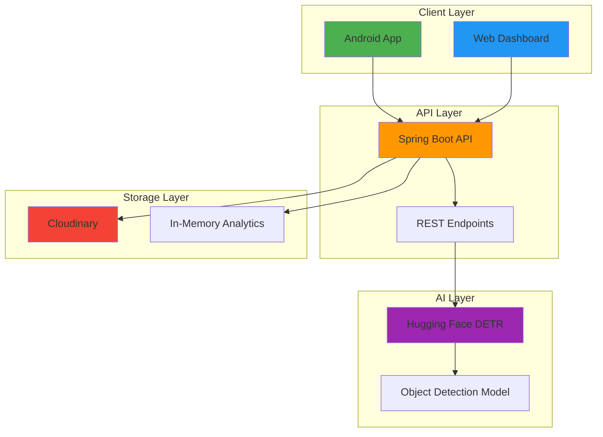

# Object Detection Platform 🎯


**A comprehensive real-time object detection platform with AI-powered image analysis**

[🚀 Quick Start](#quick-start) •
[📖 Documentation](https://EliorMauda.github.io/Advanced_Seminar_in_Mobile_Development_2025/) •
[🔧 Installation](#installation) •
[💻 Demo](#demo) •
[🤝 Contributing](#contributing)

---

## 🌟 Overview

The Object Detection Platform is a full-stack solution that brings AI-powered object detection to your fingertips. Built with modern technologies and designed for scalability, it offers seamless integration across web and mobile platforms.

### ✨ Key Features

- 🎯 **Real-time Object Detection** - Live camera feed analysis with instant overlay visualization
- 📱 **Cross-Platform SDK** - Easy Android integration with minimal setup
- 🌐 **Web Dashboard** - Comprehensive monitoring and analytics portal  
- ⚡ **High Performance** - Optimized for speed with advanced coordinate transformation
- 🤖 **AI-Powered** - Facebook's DETR model via Hugging Face integration
- ☁️ **Cloud Ready** - Scalable architecture with Cloudinary storage
- 📊 **Analytics** - Real-time metrics and detection history tracking

---

## 🏗️ Architecture



### 🔧 Technology Stack

| Layer | Technology | Purpose |
|-------|------------|---------|
| **Frontend** | Bootstrap 5, Chart.js, Vanilla JS | Responsive web dashboard |
| **Backend** | Spring Boot 2.7, Java 11 | RESTful API service |
| **Mobile** | Android SDK, CameraX, Retrofit | Native mobile integration |
| **AI/ML** | Hugging Face DETR (Facebook) | Object detection processing |
| **Storage** | Cloudinary, H2 Database | Image hosting & analytics |
| **Monitoring** | Node.js, Express | Dashboard backend |

---

## 🎬 Demo

### 📱 Android App in Action

| Main Menu | Live Detection | Results View |
|-----------|----------------|--------------|
|  |  |  |

### 🌐 Web Dashboard


[Portal video](https://github.com/user-attachments/assets/5502927b-8e82-44cc-abae-c89344c2165b)


*Real-time analytics dashboard with live metrics and detection management*

### 🎯 Detection Examples

| Original Image | Detection Result |
|----------------|------------------|
|  |  |

*Example: Person detection with 94.7% confidence*

---

## 🚀 Quick Start

Get up and running in 5 minutes!

### Prerequisites

- ☕ Java 11 or higher
- 📱 Android Studio Arctic Fox+
- 🟢 Node.js 14+
- 🔑 [Hugging Face API Token](https://huggingface.co/settings/tokens)
- ☁️ [Cloudinary Account](https://cloudinary.com/) (optional)

### 1️⃣ Clone the Repository

```bash
git clone https://github.com/EliorMauda/Advanced_Seminar_in_Mobile_Development_2025.git
cd Advanced_Seminar_in_Mobile_Development_2025
```

### 2️⃣ Start the API Service

```bash
cd backend-api
export HUGGINGFACE_API_TOKEN=your_token_here
./mvnw spring-boot:run
```

🚀 **API available at:** `http://localhost:8080`

### 3️⃣ Launch the Dashboard

```bash
cd dashboard-portal
npm install
npm start
```

🌐 **Dashboard available at:** `http://localhost:3000`

### 4️⃣ Test Your Setup

1. Open the dashboard at `http://localhost:3000`
2. Upload an image or paste an image URL
3. Watch the magic happen! ✨

---

## 📱 Android Integration

### Quick Integration

Add to your `build.gradle`:

```gradle
dependencies {
    implementation 'com.github.EliorMauda:android-object-detection-sdk:v0.1.5'
}
```

### Initialize & Use

```java
// In your Application class
ImageDetector.init("https://your-api-url.com");

// Detect from image file
ImageDetector.detectFromFile(imageFile, new ImageDetectionListener() {
    @Override
    public void onResult(DetectionResult result) {
        // Handle detection results
        List<DetectedObject> objects = result.getDetectedObjects();
        updateUI(objects);
    }
    
    @Override
    public void onError(Exception e) {
        Log.e(TAG, "Detection failed", e);
    }
});
```

### Live Camera Detection

```java
// Start live detection
ImageDetector.startLiveDetection(this, previewView, new LiveDetectionListener() {
    @Override
    public void onDetectionResult(DetectionResult result, long frameTimestamp) {
        runOnUiThread(() -> updateOverlay(result));
    }
});
```

---

## 🌐 API Usage

### Upload Image

```bash
curl -X POST http://localhost:8080/api/detect \
  -H "Content-Type: multipart/form-data" \
  -F "image=@your_image.jpg"
```

### Detect from URL

```bash
curl -X POST http://localhost:8080/api/detect/url \
  -H "Content-Type: application/json" \
  -d '{"url": "https://example.com/image.jpg"}'
```

### Response Format

```json
{
  "imageUrl": "https://res.cloudinary.com/demo/image/upload/...",
  "detectedObjects": [
    {
      "label": "person",
      "confidence": 0.9847,
      "box": {
        "xMin": 0.123,
        "yMin": 0.456,
        "xMax": 0.789,
        "yMax": 0.834
      }
    }
  ],
  "processingTimeMs": 1250,
  "error": null
}
```

---

## 📊 Dashboard Features

### Real-time Metrics
- 📈 **Live Analytics** - API calls, response times, error rates
- 📊 **Performance Charts** - Interactive visualizations with Chart.js
- 🔍 **Detection History** - Browse and filter past detections
- ⚙️ **System Health** - Monitor service status and uptime

### Detection Management
- 🖼️ **Image Upload** - Direct web-based detection
- 🔗 **URL Processing** - Analyze images from URLs
- 📱 **Device Tracking** - Monitor detection sources
- 💾 **Results Storage** - Persistent detection history

### Configuration
- 🎛️ **Detection Parameters** - Confidence thresholds and limits
- 🎨 **Visualization Settings** - Overlay customization
- 🔧 **API Configuration** - Endpoint and timeout settings
- 📋 **Model Management** - Switch between AI models

---

## 🛠️ Installation

### Development Setup

#### Backend API

```bash
cd backend-api

# Set environment variables
export HUGGINGFACE_API_TOKEN=your_token
export CLOUDINARY_CLOUD_NAME=your_cloud_name
export CLOUDINARY_API_KEY=your_api_key
export CLOUDINARY_API_SECRET=your_api_secret

# Run development server
./mvnw spring-boot:run
```

#### Dashboard Portal

```bash
cd dashboard-portal

# Install dependencies
npm install

# Start development server
npm run dev
```

#### Android SDK

```gradle
// Add to your app/build.gradle
dependencies {
    implementation 'com.github.EliorMauda:android-object-detection-sdk:v0.1.5'
}

// Add to your project/build.gradle
allprojects {
    repositories {
        maven { url 'https://jitpack.io' }
    }
}
```

### Production Deployment

#### 🐳 Docker Compose

```yaml
version: '3.8'
services:
  api:
    build: ./backend-api
    ports:
      - "8080:8080"
    environment:
      - HUGGINGFACE_API_TOKEN=${HUGGINGFACE_API_TOKEN}
      - CLOUDINARY_CLOUD_NAME=${CLOUDINARY_CLOUD_NAME}
      - CLOUDINARY_API_KEY=${CLOUDINARY_API_KEY}
      - CLOUDINARY_API_SECRET=${CLOUDINARY_API_SECRET}
  
  dashboard:
    build: ./dashboard-portal
    ports:
      - "3000:3000"
    depends_on:
      - api
```

```bash
docker-compose up -d
```

#### ☁️ Railway Deployment

1. Connect your GitHub repository to [Railway](https://railway.app)
2. Set environment variables in Railway dashboard
3. Deploy API service from `backend-api` directory
4. Deploy dashboard from `dashboard-portal` directory

---

## 🔧 Configuration

### Environment Variables

#### API Service

```bash
# Required
HUGGINGFACE_API_TOKEN=hf_your_token_here

# Optional (for image storage)
CLOUDINARY_CLOUD_NAME=your_cloud_name
CLOUDINARY_API_KEY=your_api_key  
CLOUDINARY_API_SECRET=your_api_secret

# Server settings
SERVER_PORT=8080
```

#### Dashboard

```bash
PORT=3000
NODE_ENV=production
API_BASE_URL=https://your-api-domain.com/api
```

### Android SDK Configuration

```java
// Initialize in your Application class
public class MyApplication extends Application {
    @Override
    public void onCreate() {
        super.onCreate();
        ImageDetector.init("https://object-detection-api-production.up.railway.app");
    }
}
```

---

## 📱 Android Example App

The included example app demonstrates all SDK capabilities:

### Features Showcase

- **📷 Camera Detection** - Real-time object detection with camera preview
- **🖼️ Gallery Integration** - Select and analyze images from gallery
- **🔗 URL Processing** - Analyze images from web URLs
- **⚙️ Settings Management** - Configure API endpoints and preferences
- **📊 Results Display** - Detailed detection results with confidence scores

### Building the Example

```bash
cd android-example-app

# Build debug APK
./gradlew assembleDebug

# Install on connected device
adb install app/build/outputs/apk/debug/app-debug.apk
```

### Key Implementation Examples

#### MainActivity - Entry Point
```java
public class MainActivity extends AppCompatActivity {
    private static final String DEFAULT_API_URL = 
        "https://object-detection-api-production.up.railway.app";
    
    @Override
    protected void onCreate(Bundle savedInstanceState) {
        super.onCreate(savedInstanceState);
        initializeSDK();
        setupDetectionButtons();
    }
}
```

#### Live Detection Activity
```java
private void startLiveDetection() {
    ImageDetector.startLiveDetection(this, previewView, 
        new LiveDetectionListener() {
            @Override
            public void onDetectionResult(DetectionResult result, long timestamp) {
                runOnUiThread(() -> overlayView.updateDetections(result));
            }
        });
}
```

---

## 🎯 Use Cases

### 🏢 Business Applications

- **🛡️ Security Systems** - Automated surveillance and monitoring
- **🏪 Retail Analytics** - Customer behavior and product tracking  
- **🚗 Traffic Management** - Vehicle and pedestrian counting
- **🏥 Healthcare** - Medical image analysis assistance
- **📱 Mobile Apps** - Enhanced camera functionality

### 👨‍💻 Developer Benefits

- **⚡ Rapid Prototyping** - Quick integration with minimal code
- **🔧 Flexible Architecture** - Modular components for custom solutions
- **📊 Built-in Analytics** - Comprehensive monitoring out of the box
- **🌐 Cross-Platform** - Consistent API across web and mobile
- **📚 Comprehensive Docs** - Detailed guides and examples

---

## 🧪 Testing

### API Testing

```bash
# Run unit tests
cd backend-api
./mvnw test

# Integration tests
./mvnw test -Dtest=DetectionControllerIT
```

### Android SDK Testing

```bash
cd android-sdk
./gradlew test
./gradlew connectedAndroidTest
```

### Dashboard Testing

```bash
cd dashboard-portal
npm test
npm run test:e2e
```

---

## 🚨 Troubleshooting

### Common Issues & Solutions

#### 🔌 Connection Issues

**Problem**: `Connection refused` when calling API

```bash
# Check if API is running
curl http://localhost:8080/api/detect/health

# Expected response: {"status":"UP"}
```

#### 🔑 Authentication Issues

**Problem**: `Invalid Hugging Face token`

```bash
# Verify your token
curl -H "Authorization: Bearer YOUR_TOKEN" \
  https://huggingface.co/api/whoami
```

#### 📱 Android Integration Issues

**Problem**: `ImageDetector not initialized`

```java
// Solution: Initialize in Application class
public class MyApplication extends Application {
    @Override
    public void onCreate() {
        super.onCreate();
        ImageDetector.init("https://your-api-url.com");
    }
}
```

#### 🎨 Overlay Alignment Issues

**Problem**: Detection boxes not aligned with objects

```java
// Solution: Use proper coordinate transformation
overlayView.setDetectionResult(result, 
    frameWidth, frameHeight,        // Original camera resolution
    displayWidth, displayHeight,    // Preview display size
    offsetX, offsetY);             // Letterbox offsets
```

### Performance Optimization

#### ⚡ API Performance

- **Connection Pooling** - Reuse HTTP connections
- **Response Caching** - Cache repeated requests
- **Image Optimization** - Compress images before processing

#### 📱 Mobile Performance

- **Frame Skipping** - Process every N-th frame for live detection
- **Background Processing** - Use separate threads for heavy operations
- **Memory Management** - Properly dispose of camera resources

---

## 🤝 Contributing

We welcome contributions! Here's how to get started:

### Development Workflow

1. **🍴 Fork** the repository
2. **🌿 Create** a feature branch: `git checkout -b feature/amazing-feature`
3. **✨ Make** your changes with tests
4. **✅ Commit** changes: `git commit -m 'Add amazing feature'`
5. **🚀 Push** to branch: `git push origin feature/amazing-feature`
6. **📬 Open** a Pull Request

### Code Style

- **Java**: Follow [Google Java Style Guide](https://google.github.io/styleguide/javaguide.html)
- **JavaScript**: Use [Airbnb JavaScript Style Guide](https://github.com/airbnb/javascript)
- **Android**: Follow [Android Code Style](https://source.android.com/setup/contribute/code-style)

### Areas for Contribution

- 🐛 **Bug Fixes** - Help us squash bugs
- ✨ **New Features** - Add exciting capabilities
- 📚 **Documentation** - Improve guides and examples
- 🧪 **Testing** - Increase test coverage
- 🎨 **UI/UX** - Enhance user experience
- 🔧 **Performance** - Optimize algorithms and architecture

---

## 📄 License

This project is licensed under the MIT License - see the [LICENSE](https://github.com/EliorMauda/Advanced_Seminar_in_Mobile_Development_2025/blob/master/LICENSE) file for details.

---

## 🔗 Links & Resources

- 📖 **[Complete Documentation](https://EliorMauda.github.io/Advanced_Seminar_in_Mobile_Development_2025/)**
- 🐛 **[Report Issues](https://github.com/EliorMauda/Advanced_Seminar_in_Mobile_Development_2025/issues)**
- 💬 **[Discussions](https://github.com/EliorMauda/Advanced_Seminar_in_Mobile_Development_2025/discussions)**
- 🤖 **[Hugging Face DETR Model](https://huggingface.co/facebook/detr-resnet-50)**
- ☁️ **[Live Demo API](https://object-detection-api-production.up.railway.app)**

---

## 🙏 Acknowledgments

- **Facebook AI Research** - For the DETR object detection model
- **Hugging Face** - For making AI models accessible
- **Cloudinary** - For reliable image hosting
- **Android Team** - For CameraX and modern Android APIs
- **Spring Boot Community** - For the excellent framework

---

## 📈 Project Stats


---

**Built with ❤️ by [Elior Mauda](https://github.com/EliorMauda)**

*Object Detection Platform - Making AI accessible to everyone*

⭐ **Star this repository if you found it helpful!** ⭐
