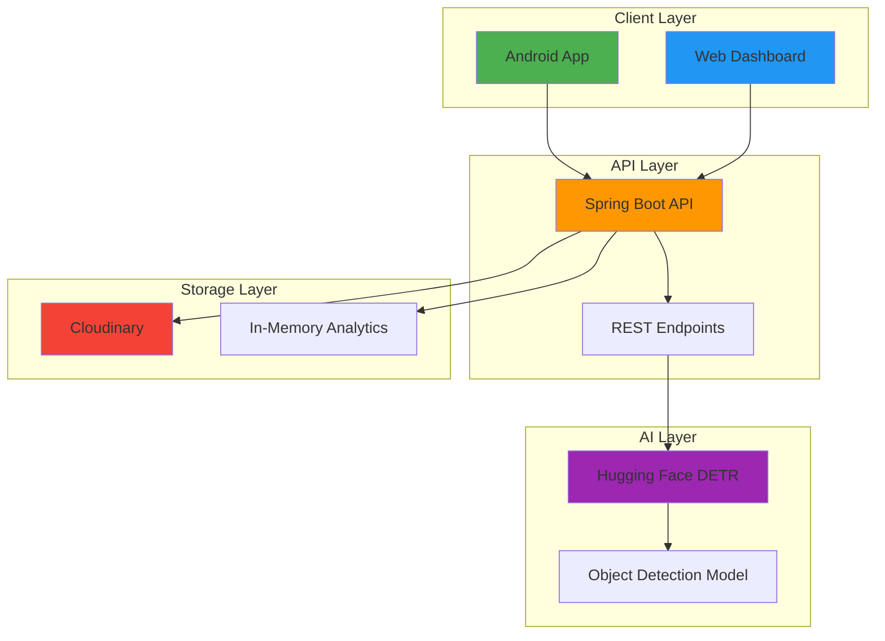

# Object Detection Platform 🎯

**A comprehensive real-time object detection platform with AI-powered image analysis**

## 📚 Table of Contents

- [Overview](#-overview)
- [Architecture](#-architecture)
- [Demo](#-demo)
- [Dashboard Features](#-dashboard-features)
- [Android Example App](#-android-example-app)
- [Use Cases](#-use-cases)
- [Performance Optimization](#-performance-optimization)
- [Contributing](#-contributing)
- [License](#-license)
- [Links & Resources](#-links--resources)
- [Acknowledgments](#-acknowledgments)

---

## 🌟 Overview

The Object Detection Platform is a full-stack solution that brings AI-powered object detection to your fingertips. Built with modern technologies and designed for scalability, it offers seamless integration across web and mobile platforms.

### ✨ Key Features

- 🎯 **Real-time Object Detection** - Live camera feed analysis with instant overlay visualization
- 📱 **Cross-Platform SDK** - Easy Android integration with minimal setup
- 🌐 **Web Dashboard** - Comprehensive monitoring and analytics portal  
- ⚡ **High Performance** - Optimized for speed with advanced coordinate transformation
- 🤖 **AI-Powered** - Facebook's DETR model via Hugging Face integration
- ☁️ **Cloud Ready** - Scalable architecture with Cloudinary storage
- 📊 **Analytics** - Real-time metrics and detection history tracking

---

## 🏗️ Architecture

### 🔧 Technology Stack

| Layer | Technology | Purpose |
|-------|------------|---------|
| **Frontend** | Bootstrap 5, Chart.js, Vanilla JS | Responsive web dashboard |
| **Backend** | Spring Boot 2.7, Java 11 | RESTful API service |
| **Mobile** | Android SDK, CameraX, Retrofit | Native mobile integration |
| **AI/ML** | Hugging Face DETR (Facebook) | Object detection processing |
| **Storage** | Cloudinary, H2 Database | Image hosting & analytics |
| **Monitoring** | Node.js, Express | Dashboard backend |

---

## 🎬 Demo

### 📱 Android App in Action

| Main Menu | Live Detection | Results View |
|-----------|----------------|--------------|
|  |  |  |

### 🌐 Web Dashboard

  
   
  
   
  
  

🎥 **Demo Video** 
[Click here to watch the entire Web Dashboard](https://github.com/user-attachments/assets/5502927b-8e82-44cc-abae-c89344c2165b)

*Real-time analytics dashboard with live metrics and detection management*

### 🎯 Detection Examples

<table>
  <tr>
    <th>Original Image</th>
    <th>Detection Result</th>
  </tr>
  <tr>
    <td></td>
    <td></td>
  </tr>
</table>

*Example: spoon detection with 99.7% confidence*  
*Example: spoon detection with 99.5% confidence*  
*Example: fork detection with 99.2% confidence*  
*Example: knife detection with 87.5% confidence*  
*Example: dining table detection with 61.3% confidence*

---

## 📊 Dashboard Features

### Real-time Metrics
- 📈 **Live Analytics** - API calls, response times, error rates
- 📊 **Performance Charts** - Interactive visualizations with Chart.js
- 🔍 **Detection History** - Browse and filter past detections
- ⚙️ **System Health** - Monitor service status and uptime

### Detection Management
- 🖼️ **Image Upload** - Direct web-based detection
- 🔗 **URL Processing** - Analyze images from URLs
- 📱 **Device Tracking** - Monitor detection sources
- 💾 **Results Storage** - Persistent detection history

### Configuration
- 🎛️ **Detection Parameters** - Confidence thresholds and limits
- 🎨 **Visualization Settings** - Overlay customization
- 🔧 **API Configuration** - Endpoint and timeout settings
- 📋 **Model Management** - Switch between AI models

---

## 📱 Android Example App

The included example app demonstrates all SDK capabilities:

### Features Showcase

- **📷 Camera Detection** - Real-time object detection with camera preview
- **🖼️ Gallery Integration** - Select and analyze images from gallery
- **🔗 URL Processing** - Analyze images from web URLs
- **⚙️ Settings Management** - Configure API endpoints and preferences
- **📊 Results Display** - Detailed detection results with confidence scores

---

## 🎯 Use Cases

### 🏢 Business Applications

- **🛡️ Security Systems** - Automated surveillance and monitoring
- **🏪 Retail Analytics** - Customer behavior and product tracking  
- **🚗 Traffic Management** - Vehicle and pedestrian counting
- **🏥 Healthcare** - Medical image analysis assistance
- **📱 Mobile Apps** - Enhanced camera functionality

### 👨‍💻 Developer Benefits

- **⚡ Rapid Prototyping** - Quick integration with minimal code
- **🔧 Flexible Architecture** - Modular components for custom solutions
- **📊 Built-in Analytics** - Comprehensive monitoring out of the box
- **🌐 Cross-Platform** - Consistent API across web and mobile
- **📚 Comprehensive Docs** - Detailed guides and examples

---

### Performance Optimization

#### ⚡ API Performance

- **Connection Pooling** - Reuse HTTP connections
- **Response Caching** - Cache repeated requests
- **Image Optimization** - Compress images before processing

#### 📱 Mobile Performance

- **Frame Skipping** - Process every N-th frame for live detection
- **Background Processing** - Use separate threads for heavy operations
- **Memory Management** - Properly dispose of camera resources

---

## 🤝 Contributing

We welcome contributions! Here's how to get started:

### Development Workflow

1. **🍴 Fork** the repository
2. **🌿 Create** a feature branch: `git checkout -b feature/amazing-feature`
3. **✨ Make** your changes with tests
4. **✅ Commit** changes: `git commit -m 'Add amazing feature'`
5. **🚀 Push** to branch: `git push origin feature/amazing-feature`
6. **📬 Open** a Pull Request

### Code Style

- **Java**: Follow [Google Java Style Guide](https://google.github.io/styleguide/javaguide.html)
- **JavaScript**: Use [Airbnb JavaScript Style Guide](https://github.com/airbnb/javascript)
- **Android**: Follow [Android Code Style](https://source.android.com/setup/contribute/code-style)

### Areas for Contribution

- 🐛 **Bug Fixes** - Help us squash bugs
- ✨ **New Features** - Add exciting capabilities
- 📚 **Documentation** - Improve guides and examples
- 🧪 **Testing** - Increase test coverage
- 🎨 **UI/UX** - Enhance user experience
- 🔧 **Performance** - Optimize algorithms and architecture

---

## 📄 License

This project is licensed under the MIT License - see the [LICENSE](https://github.com/EliorMauda/Advanced_Seminar_in_Mobile_Development_2025/blob/master/LICENSE) file for details.

---

## 🔗 Links & Resources

- 📖 **[Complete Documentation](https://EliorMauda.github.io/Advanced_Seminar_in_Mobile_Development_2025/)**
- 🐛 **[Report Issues](https://github.com/EliorMauda/Advanced_Seminar_in_Mobile_Development_2025/issues)**
- 💬 **[Discussions](https://github.com/EliorMauda/Advanced_Seminar_in_Mobile_Development_2025/discussions)**
- 🤖 **[Hugging Face DETR Model](https://huggingface.co/facebook/detr-resnet-50)**

---

## 🙏 Acknowledgments

- **Facebook AI Research** - For the DETR object detection model
- **Hugging Face** - For making AI models accessible
- **Cloudinary** - For reliable image hosting
- **Android Team** - For CameraX and modern Android APIs
- **Spring Boot Community** - For the excellent framework

---

## 📈 Project Stats

---

**Built by [Elior Mauda](https://github.com/EliorMauda)**

⭐ **Star this repository if you found it helpful!** ⭐
